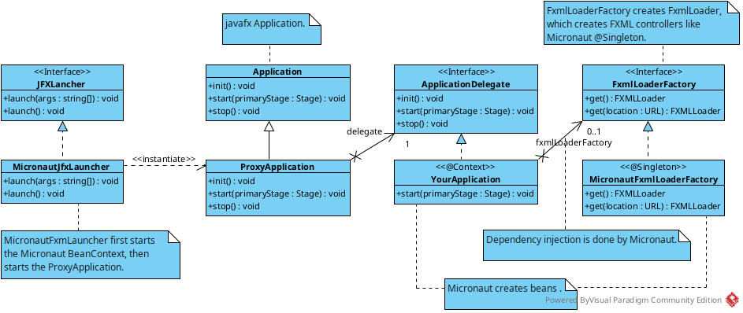

# micronaut-javafx-launcher.

micronaut-javafx-launcher is a lightweight [JavaFX](https://openjfx.io/) application launcher. It
enables the use of [Micronaut](https://micronaut.io/) dependency injection in javafx application and
controllers.

## Features.

You can use micronaut DI in the main javafx application and javafx controllers.

## Project history.

When trying to use [Supernaut.FX](https://github.com/SupernautApp/SupernautFX), it turned out that
the startup process could be easier if you focus only on micronaut and change your mindset from "
javafx first" to "micronaut first". See micronaut.javafx.launcher.impl.MicronautJFXLauncher.
Moreover, this approach allows hiding implementation details.

## How does this work.

Look at the class diagram .

1. You implement the micronaut.javafx.launcher.ApplicationDelegate interface. But you do not extend
   the javafx.application.Application class!
2. micronaut.javafx.launcher.impl.MicronautJFXLauncher instantiates
   micronaut.javafx.launcher.impl.ProxyApplication, which delegates init(), start(), stop() calls to
   your application.
3. micronaut.javafx.launcher.jfx.impl.FxmlLoaderFactory creates javafx.fxml.FXMLLoader which creates
   javafx controllers like micronaut @Singleton.

See also micronaut.javafx.demo.

## Building micronaut-javafx-launcher.

1. Clone git repository.
2. Go to the project directory.
3. ./gradlew clean build.

You can also import the project into your development environment and start the build process from
there.

The demo application can be found in the micronaut-javafx-demo/build/distributions directory.

## See also.

1. [Supernaut.FX](https://github.com/SupernautApp/SupernautFX)
2. [Gluon Ignite](https://gluonhq.com/labs/ignite/)